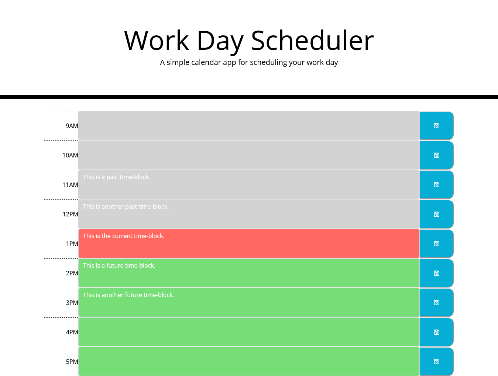

# work-day-planner-hw5

## Description

This is a simple planner, built via Bootstrap, with a text box for each hour which the user can fill in. When a save button is clicked, the text in the corresponding box is saved to local storage. Upon reloading the page, the data is retrieved and filled back into the boxes. These tasks are done with the help of jQuery.

In addition, Moment API is utilized to fill each hour box with a color based on the current hour (gray = past, red = present, green = future). The coloration/time is only updated upon reloading the page.

## Live Link
https://mattyp1007.github.io/work-day-planner-hw5/

## Screenshot
